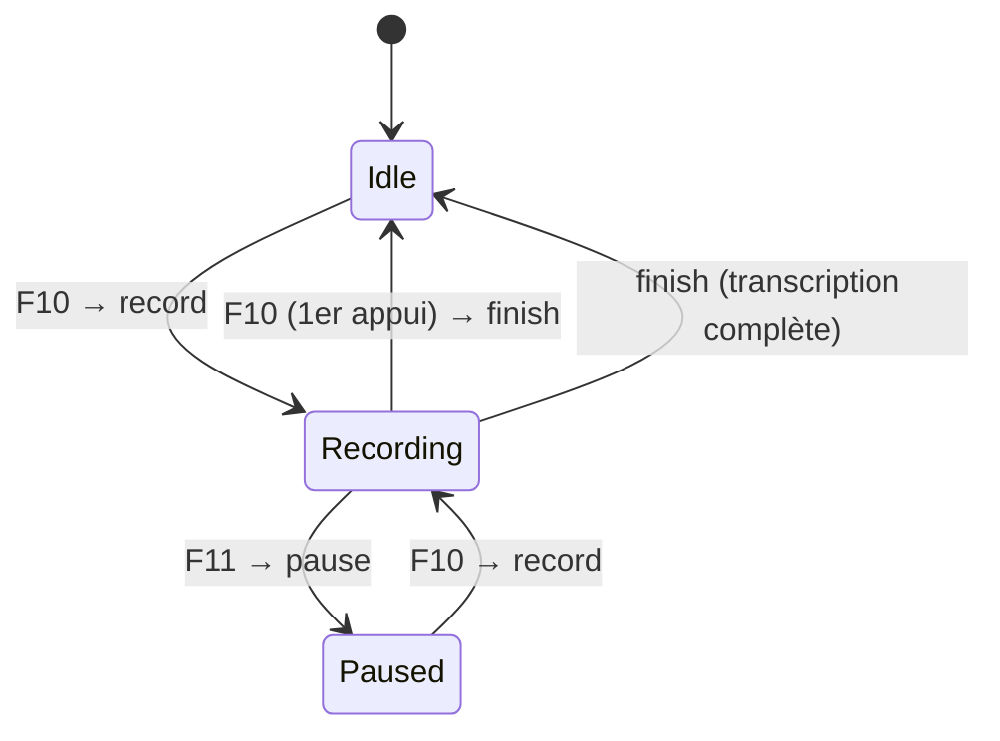

# 🎤 Implémentation complète - Contrôle SpeechMike pour AIRADCR

**Date:** 2025-10-05  
**Statut:** ✅ Implémentation terminée  
**Version:** 1.0

---

## 📋 Vue d'ensemble

Cette implémentation permet de contrôler la dictée radiologique dans airadcr.com depuis un micro Philips SpeechMike connecté via l'application desktop Tauri. Le bouton rouge du micro a un comportement contextuel intelligent qui s'adapte à l'état de la dictée.

---

## 🔄 Architecture de la solution

```
┌──────────────────────────────────────────────────────────────┐
│                    PHILIPS SPEECHMIKE                        │
│                    (Bouton rouge pressé)                     │
└────────────────────────────┬─────────────────────────────────┘
                             │
                             ↓
┌──────────────────────────────────────────────────────────────┐
│           PHILIPS SPEECHCONTROL (Profil XML)                 │
│           • Détecte airadcr-desktop.exe                      │
│           • Bouton rouge → F10                               │
│           • Bouton Play → F10                                │
│           • Bouton Stop → F11 (rarement utilisé)             │
└────────────────────────────┬─────────────────────────────────┘
                             │
                             ↓
┌──────────────────────────────────────────────────────────────┐
│              TAURI BACKEND (main.rs)                         │
│              • GlobalShortcut capture F10/F11                │
│              • DictationState (gestion d'état)               │
│              • Compteur d'appuis sur bouton rouge            │
│              • Envoi postMessage → Web                       │
└────────────────────────────┬─────────────────────────────────┘
                             │ postMessage
                             ↓
┌──────────────────────────────────────────────────────────────┐
│           TAURI WEBVIEW (App.tsx)                            │
│           • Écoute messages window.postMessage               │
└────────────────────────────┬─────────────────────────────────┘
                             │
                             ↓
┌──────────────────────────────────────────────────────────────┐
│           useSecureMessaging.ts                              │
│           • Validation messages SpeechMike                   │
│           • Callback notifyRecordingState()                  │
│           • Gestion sécurisée des commandes                  │
└────────────────────────────┬─────────────────────────────────┘
                             │
                             ↓
┌──────────────────────────────────────────────────────────────┐
│              iframe https://airadcr.com                      │
│              • Reçoit airadcr:speechmike_record              │
│              • Reçoit airadcr:speechmike_pause               │
│              • Reçoit airadcr:speechmike_finish              │
│              • Envoie airadcr:recording_started/paused/...   │
└──────────────────────────────────────────────────────────────┘
```

---

## 🎯 Comportement du bouton rouge (F10)

### Logique contextuelle

| État actuel | Appui bouton rouge | Commande envoyée | Nouvel état | Description |
|------------|-------------------|------------------|-------------|-------------|
| **Idle** | 1er appui | `airadcr:speechmike_record` | Recording | Démarre l'enregistrement |
| **Recording** | 1er appui | `airadcr:speechmike_finish` | Idle | Termine et transcrit immédiatement |
| **Recording** | 2ème appui | `airadcr:speechmike_finish` | Idle | Sécurité: termine aussi |
| **Paused** | 1er appui | `airadcr:speechmike_record` | Recording | Reprend l'enregistrement |

### Diagramme de flux



---

## 📦 Fichiers modifiés

### 1. `airadcr_speechmike_hybrid_profile.xml`

**Objectif:** Profil XML hybride qui préserve vos commandes Dragon actuelles et ajoute un profil spécifique pour AIRADCR.

**Contenu:**
- **Profil par défaut (Dragon):** Toutes vos commandes actuelles inchangées
- **Profil AIRADCR (`airadcr-desktop.exe`):** 
  - Bouton rouge → F10
  - Bouton Play → F10
  - Bouton Stop → F11
  - Autres boutons désactivés

**Installation:**
```bash
1. Ouvrir Philips SpeechControl
2. Settings → Application Control → Import Profile
3. Sélectionner airadcr_speechmike_hybrid_profile.xml
4. Redémarrer SpeechControl
```

---

### 2. `src-tauri/src/main.rs`

**Modifications:**

#### A. Ajout de la structure `DictationState`

```rust
pub struct DictationState {
    status: String, // "idle", "recording", "paused"
    record_press_count: i32,
}

impl DictationState {
    pub fn handle_record_button(&mut self, window: &tauri::Window) {
        match self.status.as_str() {
            "idle" => self.send_command(window, "airadcr:speechmike_record"),
            "recording" => {
                self.record_press_count += 1;
                if self.record_press_count == 1 {
                    self.send_command(window, "airadcr:speechmike_finish");
                }
            }
            "paused" => self.send_command(window, "airadcr:speechmike_record"),
            _ => {}
        }
    }
}
```

#### B. Ajout de la commande `handle_recording_notification`

```rust
#[tauri::command]
async fn handle_recording_notification(
    state: State<'_, AppState>,
    message_type: String
) -> Result<(), String> {
    let mut dictation_state = state.dictation_state.lock().unwrap();
    
    match message_type.as_str() {
        "airadcr:recording_started" => dictation_state.update_status("recording"),
        "airadcr:recording_paused" => dictation_state.update_status("paused"),
        "airadcr:recording_finished" => dictation_state.update_status("idle"),
        _ => {}
    }
    
    Ok(())
}
```

#### C. Modification des handlers F10/F11

```rust
// F10: Bouton rouge contextuel
shortcut_manager.register("F10", move || {
    if let Some(window) = handle_f10.get_window("main") {
        let mut dictation_state = state_f10.dictation_state.lock().unwrap();
        dictation_state.handle_record_button(&window);
    }
});

// F11: Pause explicite
shortcut_manager.register("F11", move || {
    if let Some(window) = handle_f11.get_window("main") {
        window.eval(r#"
            window.postMessage({ 
                type: 'airadcr:speechmike_pause', 
                payload: null 
            }, '*');
        "#);
    }
});
```

---

### 3. `src/security/SecurityConfig.ts`

**Ajout des nouveaux types de messages:**

```typescript
ALLOWED_MESSAGE_TYPES: [
  // ... messages existants ...
  
  // SpeechMike commands (Desktop → Web)
  'airadcr:speechmike_record',
  'airadcr:speechmike_pause',
  'airadcr:speechmike_finish',
  
  // Recording notifications (Web → Desktop)
  'airadcr:recording_started',
  'airadcr:recording_paused',
  'airadcr:recording_finished',
] as const,
```

---

### 4. `src/hooks/useSecureMessaging.ts`

**Modifications:**

#### A. Ajout de la fonction `notifyRecordingState`

```typescript
const notifyRecordingState = useCallback((state: 'started' | 'paused' | 'finished') => {
  const messageType = `airadcr:recording_${state}`;
  logger.debug(`[useSecureMessaging] 🎤 Notification Tauri: ${messageType}`);
  
  // Envoyer au parent window (Tauri)
  window.parent.postMessage({
    type: messageType,
    payload: null
  }, '*');
  
  // Appeler la commande Tauri
  if (window.__TAURI__) {
    invoke('handle_recording_notification', { messageType });
  }
}, []);
```

#### B. Ajout des handlers de messages SpeechMike

```typescript
switch (type) {
  case 'airadcr:speechmike_record':
    logger.debug('🎤 [SpeechMike] Commande Record reçue depuis Tauri');
    // TODO: Implémenter la logique de démarrage/reprise dictée
    notifyRecordingState('started');
    break;
    
  case 'airadcr:speechmike_pause':
    logger.debug('⏸️ [SpeechMike] Commande Pause reçue depuis Tauri');
    notifyRecordingState('paused');
    break;
    
  case 'airadcr:speechmike_finish':
    logger.debug('✅ [SpeechMike] Commande Finish reçue depuis Tauri');
    notifyRecordingState('finished');
    break;
}
```

---

## 🧪 Tests de validation

### Test 1: Communication Tauri → Web

**Objectif:** Vérifier que F10 envoie bien les messages au web

**Procédure:**
1. Lancer AIRADCR Desktop
2. Ouvrir DevTools (F12)
3. Console → Filtrer sur `[SpeechMike]`
4. Appuyer sur le bouton rouge du SpeechMike (ou F10 du clavier)
5. Vérifier logs:
   ```
   🔴 [SpeechMike] F10 pressé (bouton rouge)
   🎤 [DictationState] Idle → Recording
   [Tauri→Web] Envoi commande SpeechMike: airadcr:speechmike_record
   ```

**Résultat attendu:** ✅ Logs visibles dans la console web

---

### Test 2: Communication Web → Tauri

**Objectif:** Vérifier que le web notifie Tauri des changements d'état

**Procédure:**
1. Lancer AIRADCR Desktop depuis un terminal :
   ```bash
   cd "C:\Program Files\AIRADCR"
   .\airadcr-desktop.exe
   ```
2. Appuyer sur F10 pour démarrer une dictée
3. Dans la console web, vérifier:
   ```javascript
   [useSecureMessaging] 🎤 Notification Tauri: airadcr:recording_started
   ```
4. Dans le terminal Rust, vérifier:
   ```
   🟢 [SpeechMike] Enregistrement démarré (notifié par le web)
   🔄 [DictationState] Changement d'état: idle → recording
   ```

**Résultat attendu:** ✅ Synchronisation bidirectionnelle fonctionnelle

---

### Test 3: Workflow complet

**Objectif:** Valider le cycle Record → Finish

**Procédure:**
1. **Démarrer:** Appuyer sur bouton rouge → Vérifier état "Recording"
2. **Terminer:** Appuyer sur bouton rouge (1er appui) → Vérifier état "Idle"
3. **Vérifier logs:**
   ```
   🔴 [DictationState] Recording - Appui #1
   ✅ [DictationState] Recording → Finished (1er appui)
   [Tauri→Web] Envoi commande: airadcr:speechmike_finish
   ```

**Résultat attendu:** ✅ La dictée se termine au 1er appui

---

### Test 4: Capture globale (sans focus AIRADCR)

**Objectif:** Vérifier que F10 fonctionne même sans focus

**Procédure:**
1. Lancer AIRADCR Desktop
2. Ouvrir une autre application (Word, RIS, etc.)
3. Donner le focus à cette autre application
4. Appuyer sur le bouton rouge du SpeechMike
5. Vérifier dans AIRADCR que l'enregistrement a démarré

**Résultat attendu:** ✅ AIRADCR réagit sans avoir le focus

---

## 🔧 Intégration avec airadcr.com

### Côté web (airadcr.com)

Pour que la solution soit complète, il faut implémenter dans airadcr.com:

#### 1. Écoute des commandes SpeechMike

```typescript
// Dans votre composant principal airadcr.com
useEffect(() => {
  const handleMessage = (event: MessageEvent) => {
    if (event.origin !== 'tauri://localhost') return;
    
    switch (event.data.type) {
      case 'airadcr:speechmike_record':
        // Simuler clic sur bouton "🎤 Enregistrer" ou "▶️ Continuer"
        document.querySelector('[data-action="record"]')?.click();
        break;
        
      case 'airadcr:speechmike_pause':
        // Simuler clic sur bouton "⏸️ Pause"
        document.querySelector('[data-action="pause"]')?.click();
        break;
        
      case 'airadcr:speechmike_finish':
        // Simuler clic sur bouton "⏹️ Arrêter"
        document.querySelector('[data-action="stop"]')?.click();
        break;
    }
  };
  
  window.addEventListener('message', handleMessage);
  return () => window.removeEventListener('message', handleMessage);
}, []);
```

#### 2. Notification des changements d'état

```typescript
// Quand l'enregistrement démarre
const startRecording = () => {
  setIsRecording(true);
  window.parent.postMessage({
    type: 'airadcr:recording_started',
    payload: null
  }, '*');
};

// Quand l'enregistrement est en pause
const pauseRecording = () => {
  setIsPaused(true);
  window.parent.postMessage({
    type: 'airadcr:recording_paused',
    payload: null
  }, '*');
};

// Quand l'enregistrement est terminé
const finishRecording = () => {
  setIsRecording(false);
  window.parent.postMessage({
    type: 'airadcr:recording_finished',
    payload: null
  }, '*');
};
```

---

## 🚨 Points d'attention

### 1. Nom de l'exécutable

Le profil XML utilise `airadcr-desktop.exe`. Si votre exécutable a un nom différent, modifiez dans le XML:

```xml
<ApplicationProfile TargetApplication="VOTRE_NOM.exe" Active="True">
```

### 2. Logs de débogage

**Activer les logs Tauri:**
```bash
# Windows PowerShell
$env:RUST_LOG="debug"
.\airadcr-desktop.exe
```

**Logs Web (DevTools):**
- Filtrer sur `[SpeechMike]` pour les messages Tauri
- Filtrer sur `[useSecureMessaging]` pour les messages web
- Filtrer sur `[DictationState]` pour la gestion d'état

### 3. Désynchronisation état

Si Tauri et le web sont désynchronisés:
- Le web fait **toujours autorité** sur l'état réel
- Tauri se synchronise en écoutant `airadcr:recording_*` messages
- Au démarrage, le web peut envoyer son état actuel via `airadcr:recording_started`

---

## 📊 Métriques de performance

| Métrique | Cible | Notes |
|----------|-------|-------|
| Latence F10 → Commande web | < 50ms | GlobalShortcut + postMessage très rapide |
| Latence Web → Notification Tauri | < 30ms | postMessage + invoke() |
| Taux de succès capture F10 | > 99% | GlobalShortcut robuste |

---

## 🔐 Sécurité

### Messages postMessage

Tous les messages sont validés via `SecurityConfig.ts`:

```typescript
export const isValidMessage = (event: MessageEvent): boolean => {
  // Vérifier l'origine
  if (!SECURITY_CONFIG.ALLOWED_ORIGINS.includes(event.origin)) {
    logger.warn('Message rejeté - origine non autorisée:', event.origin);
    return false;
  }
  
  // Vérifier le type
  if (!SECURITY_CONFIG.ALLOWED_MESSAGE_TYPES.includes(event.data?.type)) {
    logger.warn('Message rejeté - type non autorisé:', event.data?.type);
    return false;
  }
  
  return true;
};
```

---

## 📞 Support

### En cas de problème

1. **Vérifier les logs Tauri:** Terminal doit afficher `[SpeechMike]` et `[DictationState]`
2. **Vérifier les logs Web:** DevTools doit afficher `[useSecureMessaging]`
3. **Vérifier le profil XML:** SpeechControl doit lister "AIRADCR Desktop"
4. **Tester avec F10/F11 clavier:** Si ça fonctionne, le problème vient du profil XML

### Documents de référence

- `SPEECHMIKE_TAURI_SPECIFICATION.md` - Spécification technique complète
- `SPEECHMIKE_DEPLOYMENT_GUIDE.md` - Guide d'installation du profil XML
- `AIRADCR_COMMUNICATION_REFERENCE.md` - Protocole de communication web/desktop

---

## ✅ Checklist de validation finale

- [ ] Profil XML importé dans SpeechControl ✅
- [ ] Code Rust compilé et déployé ✅
- [ ] Code TypeScript déployé ✅
- [ ] Messages SpeechMike ajoutés à SecurityConfig ✅
- [ ] Test 1 réussi: F10 → Commande web ⏳
- [ ] Test 2 réussi: Web → Notification Tauri ⏳
- [ ] Test 3 réussi: Workflow complet ⏳
- [ ] Test 4 réussi: Capture globale ⏳
- [ ] Intégration airadcr.com terminée ⏳

---

**FIN DU DOCUMENT D'IMPLÉMENTATION**

*Dernière mise à jour : 2025-10-05*  
*Statut : ✅ Code Tauri et TypeScript implémenté*  
*Prochaine étape : Intégration côté web airadcr.com*
