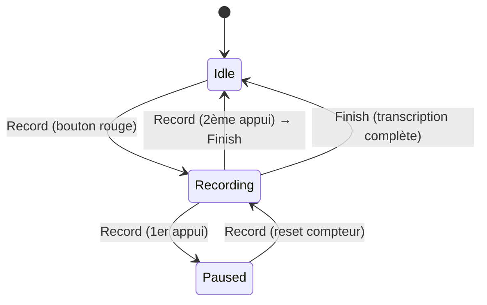
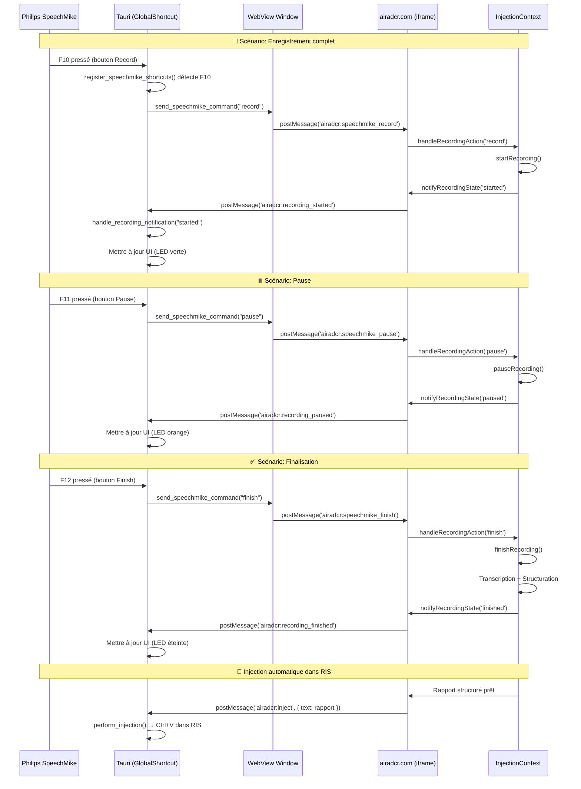

# 📋 SPÉCIFICATION TECHNIQUE - Intégration SpeechMike Tauri

**Version:** 1.0  
**Date:** 2025-10-05  
**Projet:** AIRADCR Desktop Application  
**Périmètre:** Communication bidirectionnelle Tauri ↔ airadcr.com pour contrôle SpeechMike

---

## 🎯 Vue d'ensemble

Cette spécification définit le protocole de communication complet entre l'application desktop Tauri et l'application web airadcr.com pour l'intégration du périphérique **Philips SpeechMike**. Le SpeechMike permet de contrôler la dictée radiologique via des boutons physiques mappés sur les touches F10, F11 et F12.

### Objectifs fonctionnels

1. **Capture globale** : Détecter les touches F10/F11/F12 même quand AIRADCR n'a pas le focus
2. **Communication bidirectionnelle** : Envoyer les commandes au web et recevoir les notifications d'état
3. **Compatibilité Dragon** : Coexister avec Dragon NaturallySpeaking via profils SpeechControl contextuels
4. **Feedback visuel** : Informer l'utilisateur de l'état de l'enregistrement en temps réel

---

## 🔴 Comportement du bouton rouge Speech Mike

### Vue d'ensemble de la logique contextuelle

Le bouton rouge du Speech Mike a un **comportement contextuel** qui dépend de l'état actuel de la dictée. L'application Tauri doit maintenir un état synchronisé avec le web pour envoyer la commande appropriée.

### Tableau des transitions d'état

| État actuel | Action utilisateur | Compteur d'appuis | Commande envoyée | Nouvel état | Description UI AIRADCR |
|------------|-------------------|-------------------|------------------|-------------|----------------------|
| **Idle** | 1er appui bouton rouge | 0 → Reset | `airadcr:speechmike_record` | Recording | Bouton bleu "🎤 Enregistrer" → "⏹️ Arrêter" |
| **Recording** | 1er appui bouton rouge | +1 | `airadcr:speechmike_pause` | Paused | Bouton "⏹️ Arrêter" → "⏸️ En pause" |
| **Recording** | 2ème appui bouton rouge | +2 | `airadcr:speechmike_finish` | Idle | Bouton "⏹️ Arrêter" → Finalisation + transcription |
| **Paused** | 1er appui bouton rouge | Reset → 0 | `airadcr:speechmike_record` | Recording | Bouton "▶️ Continuer" → "⏹️ Arrêter" |

### Diagramme de transition d'état



### Points clés d'implémentation

1. **Comptage des appuis** : L'application Tauri doit compter les appuis sur le bouton rouge uniquement en état "Recording"
2. **Reset du compteur** : Le compteur est remis à zéro quand on passe en état "Paused" ou "Idle"
3. **Synchronisation bidirectionnelle** : Le web notifie Tauri des changements d'état via `airadcr:recording_*` messages
4. **Robustesse** : Si une désynchronisation se produit, l'état du web fait autorité

### Exemple de code Rust pour gestion d'état

```rust
use std::sync::Mutex;
use tauri::{Manager, Window};

// Structure pour gérer l'état de la dictée
pub struct DictationState {
    status: String, // "idle", "recording", "paused"
    record_press_count: i32,
}

impl DictationState {
    pub fn new() -> Self {
        Self {
            status: String::from("idle"),
            record_press_count: 0,
        }
    }

    pub fn handle_record_button(&mut self, window: &Window) {
        match self.status.as_str() {
            "idle" => {
                // Démarrer la dictée
                println!("🎤 [DictationState] Idle → Recording");
                self.send_command(window, "airadcr:speechmike_record");
                self.record_press_count = 0;
            }
            "recording" => {
                self.record_press_count += 1;
                println!("🔴 [DictationState] Recording - Appui #{}", self.record_press_count);
                
                if self.record_press_count == 1 {
                    // Premier appui : mettre en pause
                    println!("⏸️ [DictationState] Recording → Paused");
                    self.send_command(window, "airadcr:speechmike_pause");
                } else if self.record_press_count >= 2 {
                    // Deuxième appui : terminer
                    println!("✅ [DictationState] Recording → Finished");
                    self.send_command(window, "airadcr:speechmike_finish");
                    self.record_press_count = 0;
                }
            }
            "paused" => {
                // Reprendre l'enregistrement (reset du compteur)
                println!("▶️ [DictationState] Paused → Recording (resume)");
                self.send_command(window, "airadcr:speechmike_record");
                self.record_press_count = 0;
            }
            _ => {
                eprintln!("⚠️ [DictationState] État inconnu: {}", self.status);
            }
        }
    }

    fn send_command(&self, window: &Window, command: &str) {
        let script = format!(
            r#"
            console.log('[Tauri→Web] Envoi commande: {}');
            window.postMessage({{ type: '{}', payload: null }}, '*');
            "#,
            command, command
        );
        
        if let Err(e) = window.eval(&script) {
            eprintln!("❌ [DictationState] Erreur envoi {}: {:?}", command, e);
        }
    }

    pub fn update_status(&mut self, new_status: String) {
        println!("🔄 [DictationState] Changement d'état: {} → {}", self.status, new_status);
        self.status = new_status;
        
        // Reset du compteur quand on quitte l'état "recording"
        if self.status != "recording" {
            self.record_press_count = 0;
        }
    }
}

// Commande Tauri pour recevoir les notifications du web
#[tauri::command]
fn handle_web_message(state: tauri::State<Mutex<DictationState>>, message_type: String) {
    let mut state = state.lock().unwrap();
    
    match message_type.as_str() {
        "airadcr:recording_started" => state.update_status(String::from("recording")),
        "airadcr:recording_paused" => state.update_status(String::from("paused")),
        "airadcr:recording_finished" => state.update_status(String::from("idle")),
        _ => eprintln!("⚠️ [handle_web_message] Type inconnu: {}", message_type),
    }
}
```

### Scénarios d'utilisation concrets

#### Scénario 1 : Dictée simple (Record → Finish direct)

```
1. Utilisateur appuie sur bouton rouge → Tauri envoie "record"
2. Web démarre enregistrement → Web notifie "recording_started"
3. Tauri passe en état "Recording" (compteur = 0)
4. Utilisateur appuie sur bouton rouge (1er fois) → Tauri envoie "pause"
5. Web met en pause → Web notifie "recording_paused"
6. Tauri passe en état "Paused" (compteur reset à 0)
7. Utilisateur appuie sur bouton rouge → Tauri envoie "record"
8. Web reprend → Web notifie "recording_started"
9. Tauri passe en état "Recording" (compteur = 0)
10. Utilisateur appuie sur bouton rouge (1er fois) → Tauri envoie "pause"
11. Utilisateur appuie sur bouton rouge (2ème fois) → Tauri envoie "finish"
12. Web termine et transcrit → Web notifie "recording_finished"
13. Tauri retourne en état "Idle"
```

#### Scénario 2 : Gestion de désynchronisation

```
❌ Problème : Le web est en "Recording" mais Tauri pense être en "Idle"

✅ Solution : À chaque démarrage, le web envoie son état actuel via "airadcr:recording_started"
→ Tauri met à jour son état interne pour correspondre au web
```

---

## 🏗️ Architecture de communication

```
┌─────────────────────────────────────────────────────────────┐
│                   Application Tauri Desktop                 │
│                                                             │
│  ┌────────────────────────────────────────────────────┐   │
│  │  GlobalShortcutManager (Rust)                      │   │
│  │  - Capture F10/F11/F12 globalement                │   │
│  │  - Thread dédié pour écoute non-bloquante         │   │
│  └──────────────────┬─────────────────────────────────┘   │
│                     │                                       │
│                     │ simulate_key_in_iframe()             │
│                     ↓                                       │
│  ┌────────────────────────────────────────────────────┐   │
│  │  WebView (Tauri Window)                            │   │
│  │  - Injecte KeyboardEvent dans iframe              │   │
│  │  - Écoute postMessage depuis iframe               │   │
│  └──────────────────┬─────────────────────────────────┘   │
│                     │ postMessage                          │
│                     ↓                                       │
│  ┌────────────────────────────────────────────────────┐   │
│  │  iframe: https://airadcr.com                       │   │
│  │                                                    │   │
│  │  ┌──────────────────────────────────────────┐    │   │
│  │  │  useSecureMessaging.ts                   │    │   │
│  │  │  - Écoute 'airadcr:speechmike_*'        │    │   │
│  │  │  - Envoie 'airadcr:recording_*'         │    │   │
│  │  └──────────────┬───────────────────────────┘    │   │
│  │                 │                                 │   │
│  │                 │ Callbacks                       │   │
│  │                 ↓                                 │   │
│  │  ┌──────────────────────────────────────────┐    │   │
│  │  │  InjectionContext                        │    │   │
│  │  │  - Gère l'état d'enregistrement         │    │   │
│  │  │  - Notifie l'UI React                   │    │   │
│  │  └──────────────────────────────────────────┘    │   │
│  └────────────────────────────────────────────────────┘   │
└─────────────────────────────────────────────────────────────┘
```

---

## 📡 Protocole de Messages

### 1️⃣ Messages Desktop → Web (Tauri → airadcr.com)

Ces messages sont envoyés **via `postMessage`** depuis Tauri vers l'iframe airadcr.com.

#### Message Type 1: `airadcr:speechmike_record`

**Déclencheur :** Touche F10 pressée ou bouton "Record" du SpeechMike  
**Payload :** `null`  
**Action attendue :** Démarrer ou reprendre l'enregistrement audio

```typescript
interface SpeechMikeRecordMessage {
  type: 'airadcr:speechmike_record';
  payload: null;
}
```

**Exemple d'envoi depuis Rust :**
```rust
let js = r#"
  window.postMessage({
    type: 'airadcr:speechmike_record',
    payload: null
  }, '*');
"#;
webview.eval(js).unwrap();
```

---

#### Message Type 2: `airadcr:speechmike_pause`

**Déclencheur :** Touche F11 pressée ou bouton "Pause" du SpeechMike  
**Payload :** `null`  
**Action attendue :** Mettre en pause l'enregistrement en cours

```typescript
interface SpeechMikePauseMessage {
  type: 'airadcr:speechmike_pause';
  payload: null;
}
```

**Exemple d'envoi depuis Rust :**
```rust
let js = r#"
  window.postMessage({
    type: 'airadcr:speechmike_pause',
    payload: null
  }, '*');
"#;
webview.eval(js).unwrap();
```

---

#### Message Type 3: `airadcr:speechmike_finish`

**Déclencheur :** Touche F12 pressée ou bouton "Finish" du SpeechMike  
**Payload :** `null`  
**Action attendue :** Terminer l'enregistrement et déclencher la transcription/structuration

```typescript
interface SpeechMikeFinishMessage {
  type: 'airadcr:speechmike_finish';
  payload: null;
}
```

**Exemple d'envoi depuis Rust :**
```rust
let js = r#"
  window.postMessage({
    type: 'airadcr:speechmike_finish',
    payload: null
  }, '*');
"#;
webview.eval(js).unwrap();
```

---

### 2️⃣ Messages Web → Desktop (airadcr.com → Tauri)

Ces messages sont envoyés **via `postMessage`** depuis l'iframe airadcr.com vers Tauri pour notifier des changements d'état.

#### Message Type 4: `airadcr:recording_started`

**Déclencheur :** L'enregistrement a démarré avec succès  
**Payload :** `null`  
**Action attendue :** Mettre à jour l'UI Tauri (LED verte, icône tray, etc.)

```typescript
interface RecordingStartedMessage {
  type: 'airadcr:recording_started';
  payload: null;
}
```

**Exemple d'envoi depuis TypeScript :**
```typescript
window.parent.postMessage({
  type: 'airadcr:recording_started',
  payload: null
}, '*');
```

---

#### Message Type 5: `airadcr:recording_paused`

**Déclencheur :** L'enregistrement a été mis en pause  
**Payload :** `null`  
**Action attendue :** Mettre à jour l'UI Tauri (LED orange, icône tray, etc.)

```typescript
interface RecordingPausedMessage {
  type: 'airadcr:recording_paused';
  payload: null;
}
```

---

#### Message Type 6: `airadcr:recording_finished`

**Déclencheur :** L'enregistrement est terminé et la transcription commence  
**Payload :** `null`  
**Action attendue :** Mettre à jour l'UI Tauri (LED éteinte, préparer l'injection)

```typescript
interface RecordingFinishedMessage {
  type: 'airadcr:recording_finished';
  payload: null;
}
```

---

## 🔧 Implémentation Rust (Tauri Backend)

### Étape 1 : Configuration des GlobalShortcuts

**Fichier :** `src-tauri/src/main.rs`

```rust
use tauri::Manager;
use tauri::GlobalShortcutManager;

// Configuration des touches SpeechMike
const SPEECHMIKE_RECORD_KEY: &str = "F10";
const SPEECHMIKE_PAUSE_KEY: &str = "F11";
const SPEECHMIKE_FINISH_KEY: &str = "F12";

fn register_speechmike_shortcuts(app: &tauri::App) -> Result<(), Box<dyn std::error::Error>> {
    let mut shortcut_manager = app.global_shortcut_manager();
    let window = app.get_window("main").ok_or("Main window not found")?;
    
    // F10 - Record/Resume
    {
        let window_clone = window.clone();
        shortcut_manager.register(SPEECHMIKE_RECORD_KEY, move || {
            println!("🎤 [SpeechMike] F10 (Record) pressé");
            send_speechmike_command(&window_clone, "record");
        })?;
    }
    
    // F11 - Pause
    {
        let window_clone = window.clone();
        shortcut_manager.register(SPEECHMIKE_PAUSE_KEY, move || {
            println!("⏸️ [SpeechMike] F11 (Pause) pressé");
            send_speechmike_command(&window_clone, "pause");
        })?;
    }
    
    // F12 - Finish
    {
        let window_clone = window.clone();
        shortcut_manager.register(SPEECHMIKE_FINISH_KEY, move || {
            println!("✅ [SpeechMike] F12 (Finish) pressé");
            send_speechmike_command(&window_clone, "finish");
        })?;
    }
    
    println!("✅ [SpeechMike] Shortcuts F10/F11/F12 enregistrés");
    Ok(())
}

fn send_speechmike_command(window: &tauri::Window, action: &str) {
    let message_type = format!("airadcr:speechmike_{}", action);
    let js = format!(
        r#"
        console.log('[Tauri→Web] Envoi de {} depuis SpeechMike');
        window.postMessage({{
            type: '{}',
            payload: null
        }}, '*');
        "#,
        message_type, message_type
    );
    
    if let Err(e) = window.eval(&js) {
        eprintln!("❌ [SpeechMike] Erreur envoi {}: {:?}", action, e);
    }
}
```

### Étape 2 : Écoute des messages depuis le Web

```rust
use tauri::Manager;

#[tauri::command]
fn handle_recording_notification(notification_type: String) {
    match notification_type.as_str() {
        "started" => {
            println!("🟢 [SpeechMike] Enregistrement démarré (notifié par le web)");
            // TODO: Mettre à jour tray icon, LED, etc.
        },
        "paused" => {
            println!("🟠 [SpeechMike] Enregistrement en pause (notifié par le web)");
            // TODO: Mettre à jour tray icon, LED, etc.
        },
        "finished" => {
            println!("⚪ [SpeechMike] Enregistrement terminé (notifié par le web)");
            // TODO: Mettre à jour tray icon, LED, etc.
        },
        _ => eprintln!("⚠️ [SpeechMike] Type de notification inconnu: {}", notification_type),
    }
}

fn main() {
    tauri::Builder::default()
        .invoke_handler(tauri::generate_handler![
            handle_recording_notification,
            // ... autres commandes existantes
        ])
        .setup(|app| {
            // Enregistrer les shortcuts SpeechMike
            register_speechmike_shortcuts(app)?;
            
            Ok(())
        })
        .run(tauri::generate_context!())
        .expect("error while running tauri application");
}
```

---

## 🔗 Implémentation TypeScript (Frontend Web)

### Étape 1 : Extension de `SecurityConfig.ts`

**Fichier :** `src/security/SecurityConfig.ts`

```typescript
export const ALLOWED_MESSAGE_TYPES = [
  // Existants
  'airadcr:inject',
  'airadcr:lock',
  'airadcr:unlock',
  'airadcr:update_lock',
  'airadcr:request_status',
  
  // Nouveaux - SpeechMike commands
  'airadcr:speechmike_record',
  'airadcr:speechmike_pause',
  'airadcr:speechmike_finish',
  
  // Nouveaux - Recording notifications
  'airadcr:recording_started',
  'airadcr:recording_paused',
  'airadcr:recording_finished',
] as const;

export type AllowedMessageType = typeof ALLOWED_MESSAGE_TYPES[number];
```

---

### Étape 2 : Extension de `useSecureMessaging.ts`

**Fichier :** `src/hooks/useSecureMessaging.ts`

```typescript
import { useEffect, useCallback, useRef } from 'react';
import { ALLOWED_MESSAGE_TYPES } from '@/security/SecurityConfig';

export const useSecureMessaging = () => {
  // ... état existant (isLocked, etc.)
  
  // Nouvelle fonction pour notifier Tauri de l'état d'enregistrement
  const notifyRecordingState = useCallback((state: 'started' | 'paused' | 'finished') => {
    const messageType = `airadcr:recording_${state}`;
    console.log(`[useSecureMessaging] Notification Tauri: ${messageType}`);
    
    window.parent.postMessage({
      type: messageType,
      payload: null
    }, '*');
  }, []);
  
  // Gestionnaire de messages entrants
  const handleSecureMessage = useCallback((event: MessageEvent) => {
    // ... validations existantes
    
    const { type, payload } = event.data;
    
    // Gérer les commandes SpeechMike
    switch (type) {
      case 'airadcr:speechmike_record':
        console.log('🎤 [SpeechMike] Commande Record reçue');
        // Déclencher l'enregistrement via InjectionContext
        if (onRecordingAction) {
          onRecordingAction('record');
        }
        break;
        
      case 'airadcr:speechmike_pause':
        console.log('⏸️ [SpeechMike] Commande Pause reçue');
        if (onRecordingAction) {
          onRecordingAction('pause');
        }
        break;
        
      case 'airadcr:speechmike_finish':
        console.log('✅ [SpeechMike] Commande Finish reçue');
        if (onRecordingAction) {
          onRecordingAction('finish');
        }
        break;
        
      // ... autres cas existants (inject, lock, etc.)
    }
  }, [onRecordingAction]);
  
  // ... useEffect pour event listener
  
  return {
    sendSecureMessage,
    notifyRecordingState, // Nouveau
    isLocked,
  };
};
```

---

### Étape 3 : Intégration dans `InjectionContext.tsx`

**Fichier :** `src/contexts/InjectionContext.tsx`

```typescript
import { useSecureMessaging } from '@/hooks/useSecureMessaging';

export const InjectionProvider = ({ children }: { children: React.ReactNode }) => {
  const [recordingState, setRecordingState] = useState<'idle' | 'recording' | 'paused'>('idle');
  const { notifyRecordingState } = useSecureMessaging();
  
  const startRecording = useCallback(() => {
    console.log('📍 Démarrage enregistrement');
    setRecordingState('recording');
    notifyRecordingState('started'); // Notifier Tauri
    
    // ... logique d'enregistrement
  }, [notifyRecordingState]);
  
  const pauseRecording = useCallback(() => {
    console.log('⏸️ Pause enregistrement');
    setRecordingState('paused');
    notifyRecordingState('paused'); // Notifier Tauri
    
    // ... logique de pause
  }, [notifyRecordingState]);
  
  const finishRecording = useCallback(() => {
    console.log('✅ Fin enregistrement');
    setRecordingState('idle');
    notifyRecordingState('finished'); // Notifier Tauri
    
    // ... logique de finalisation
  }, [notifyRecordingState]);
  
  // Gestionnaire pour les commandes SpeechMike
  const handleRecordingAction = useCallback((action: 'record' | 'pause' | 'finish') => {
    switch (action) {
      case 'record':
        if (recordingState === 'idle' || recordingState === 'paused') {
          startRecording();
        }
        break;
      case 'pause':
        if (recordingState === 'recording') {
          pauseRecording();
        }
        break;
      case 'finish':
        if (recordingState === 'recording' || recordingState === 'paused') {
          finishRecording();
        }
        break;
    }
  }, [recordingState, startRecording, pauseRecording, finishRecording]);
  
  return (
    <InjectionContext.Provider value={{
      recordingState,
      handleRecordingAction,
      // ... autres valeurs existantes
    }}>
      {children}
    </InjectionContext.Provider>
  );
};
```

---

## 🔄 Diagramme de séquence complet



---

## ✅ Checklist d'implémentation

### Côté Tauri (Rust)

- [ ] **Enregistrement GlobalShortcuts F10/F11/F12**
  - [ ] Fonction `register_speechmike_shortcuts()` créée
  - [ ] Callbacks pour chaque touche implémentés
  - [ ] Logs de débogage ajoutés
  
- [ ] **Envoi de messages au Web**
  - [ ] Fonction `send_speechmike_command()` créée
  - [ ] Messages `airadcr:speechmike_*` envoyés via `postMessage`
  - [ ] Gestion d'erreurs en cas d'échec d'injection
  
- [ ] **Réception des notifications depuis le Web**
  - [ ] Commande Tauri `handle_recording_notification` créée
  - [ ] Logs des notifications d'état
  - [ ] Mise à jour UI (tray icon, LED) selon l'état
  
- [ ] **Tests de validation**
  - [ ] F10/F11/F12 fonctionnent quand AIRADCR n'a pas le focus
  - [ ] Messages arrivent correctement dans l'iframe
  - [ ] Notifications de retour fonctionnent

---

### Côté Web (TypeScript/React)

- [ ] **Extension du protocole de sécurité**
  - [ ] Types `airadcr:speechmike_*` ajoutés à `ALLOWED_MESSAGE_TYPES`
  - [ ] Types `airadcr:recording_*` ajoutés à `ALLOWED_MESSAGE_TYPES`
  
- [ ] **Hook `useSecureMessaging`**
  - [ ] Fonction `notifyRecordingState()` créée
  - [ ] Gestion des messages `speechmike_record/pause/finish`
  - [ ] Callback `onRecordingAction` appelé correctement
  
- [ ] **Context `InjectionContext`**
  - [ ] État `recordingState` géré (idle/recording/paused)
  - [ ] Fonctions `startRecording/pauseRecording/finishRecording` implémentées
  - [ ] Notifications Tauri envoyées après changement d'état
  - [ ] Fonction `handleRecordingAction()` connectée
  
- [ ] **Tests de validation**
  - [ ] Commandes SpeechMike déclenchent les actions correctes
  - [ ] États enregistrement mis à jour dans l'UI React
  - [ ] Notifications de retour envoyées à Tauri

---

## 🚨 Points d'attention critiques

### 1. **Compatibilité avec Dragon NaturallySpeaking**

⚠️ **Problème** : Le SpeechMike peut être configuré pour envoyer des commandes Dragon (`MicrophoneToggle`) au lieu de touches F10/F11/F12.

✅ **Solution** : Créer un **profil XML contextuel** dans Philips SpeechControl :

```xml
<ApplicationProfile TargetApplication="airadcr-desktop.exe" Active="True">
  <Operation Event="spmRecordPressed">
    <OperationElement Type="Hotkey">
      <Hotkey Key="F10" Modifiers="None" />
    </OperationElement>
  </Operation>
  <!-- ... F11 et F12 pour pause/finish ... -->
</ApplicationProfile>
```

📌 **Action requise** : Fournir ce fichier XML aux utilisateurs pour import dans SpeechControl.

---

### 2. **Gestion des états incohérents**

⚠️ **Problème** : Que faire si l'utilisateur appuie sur "Pause" alors qu'aucun enregistrement n'est en cours ?

✅ **Solution** : Validation d'état dans `handleRecordingAction()` :

```typescript
if (action === 'pause' && recordingState !== 'recording') {
  console.warn('⚠️ Impossible de mettre en pause: pas d\'enregistrement en cours');
  return;
}
```

---

### 3. **Sécurité des messages `postMessage`**

⚠️ **Problème** : Actuellement, l'origine est `'*'` (accepte tous les messages).

✅ **Solution production** : Valider l'origine dans `handleSecureMessage()` :

```typescript
if (event.origin !== 'https://airadcr.com' && event.origin !== 'tauri://localhost') {
  console.error('❌ Origine non autorisée:', event.origin);
  return;
}
```

---

### 4. **Logs de débogage**

📋 **Convention de nommage des logs** :

| Composant | Préfixe | Exemple |
|-----------|---------|---------|
| Tauri Rust | `[SpeechMike]` | `🎤 [SpeechMike] F10 (Record) pressé` |
| TypeScript Hook | `[useSecureMessaging]` | `[useSecureMessaging] Notification Tauri: recording_started` |
| React Context | `[InjectionContext]` | `📍 Démarrage enregistrement` |

---

## 🧪 Tests de validation

### Test 1 : Communication Desktop → Web

**Objectif** : Vérifier que F10 déclenche bien l'enregistrement dans le web.

**Procédure** :
1. Lancer AIRADCR Desktop
2. Ouvrir DevTools (F12)
3. Aller dans Console
4. Appuyer sur F10 du SpeechMike
5. Vérifier log : `[useSecureMessaging] Commande Record reçue`

**Résultat attendu** : ✅ Message `airadcr:speechmike_record` reçu et enregistrement démarre.

---

### Test 2 : Communication Web → Desktop

**Objectif** : Vérifier que les notifications d'état remontent bien à Tauri.

**Procédure** :
1. Lancer AIRADCR Desktop
2. Côté Tauri, activer les logs console
3. Démarrer un enregistrement (F10)
4. Vérifier log Tauri : `🟢 [SpeechMike] Enregistrement démarré`

**Résultat attendu** : ✅ Message `airadcr:recording_started` reçu par Tauri.

---

### Test 3 : Workflow complet

**Objectif** : Valider le cycle Record → Pause → Resume → Finish.

**Procédure** :
1. Appuyer sur F10 → Enregistrement démarre
2. Vérifier LED verte (UI Tauri)
3. Appuyer sur F11 → Enregistrement en pause
4. Vérifier LED orange
5. Appuyer sur F10 → Reprise enregistrement
6. Vérifier LED verte
7. Appuyer sur F12 → Finalisation
8. Vérifier LED éteinte + rapport généré

**Résultat attendu** : ✅ Tous les états sont cohérents et l'injection finale fonctionne.

---

## 📚 Références techniques

### Fichiers concernés

| Fichier | Rôle |
|---------|------|
| `src-tauri/src/main.rs` | Capture F10/F11/F12 et envoi messages |
| `src/security/SecurityConfig.ts` | Types de messages autorisés |
| `src/hooks/useSecureMessaging.ts` | Réception messages et notifications |
| `src/contexts/InjectionContext.tsx` | Gestion état enregistrement |
| `src/App.tsx` | Initialisation des providers |

---

### Messages existants (compatibilité garantie)

Ces messages **ne doivent pas être modifiés** pour ne pas casser les fonctionnalités existantes :

- `airadcr:inject` → Injection de rapports dans RIS/Word
- `airadcr:lock` / `airadcr:unlock` → Verrouillage fenêtre
- `airadcr:lock_status` → Statut de verrouillage
- `airadcr:request_status` → Demande de statut
- `airadcr:test` → Test de communication

---

## 🎛️ Configuration SpeechMike (Philips SpeechControl)

### Profil XML pour AIRADCR

Ce fichier doit être importé par l'utilisateur dans **Philips SpeechControl** pour que le SpeechMike bascule automatiquement en mode F-keys quand AIRADCR est actif.

**Fichier :** `airadcr_speechmike_profile.xml`

```xml
<?xml version="1.0" encoding="utf-8"?>
<ApplicationControlConfiguration Version="9.0">
  <ApplicationProfileList>
    
    <!-- Profil par défaut : Dragon NaturallySpeaking -->
    <ApplicationProfile TargetApplication="" Active="True" Comment="Dragon par défaut">
      <OperationList>
        <Operation Event="spmRecordPressed" ModifierKey="None">
          <Steps>
            <OperationElement Type="DragonCommand" DragonCommand="MicrophoneToggle" />
          </Steps>
        </Operation>
        <Operation Event="spmStopPressed" ModifierKey="None">
          <Steps>
            <OperationElement Type="DragonCommand" DragonCommand="MicrophoneOffStop" />
          </Steps>
        </Operation>
        <Operation Event="spmPlayPressed" ModifierKey="None">
          <Steps>
            <OperationElement Type="DragonCommand" DragonCommand="PlayFromCursor" />
          </Steps>
        </Operation>
      </OperationList>
    </ApplicationProfile>
    
    <!-- Profil spécifique : AIRADCR Desktop -->
    <ApplicationProfile TargetApplication="airadcr-desktop.exe" Active="True" Comment="AIRADCR Desktop">
      <OperationList>
        <Operation Event="spmRecordPressed" ModifierKey="None" Name="AIRADCR Record">
          <Steps>
            <OperationElement Type="Hotkey">
              <Hotkey Key="F10" Modifiers="None" />
            </OperationElement>
          </Steps>
        </Operation>
        <Operation Event="spmStopPressed" ModifierKey="None" Name="AIRADCR Pause">
          <Steps>
            <OperationElement Type="Hotkey">
              <Hotkey Key="F11" Modifiers="None" />
            </OperationElement>
          </Steps>
        </Operation>
        <Operation Event="spmPlayPressed" ModifierKey="None" Name="AIRADCR Finish">
          <Steps>
            <OperationElement Type="Hotkey">
              <Hotkey Key="F12" Modifiers="None" />
            </OperationElement>
          </Steps>
        </Operation>
      </OperationList>
    </ApplicationProfile>
    
  </ApplicationProfileList>
</ApplicationControlConfiguration>
```

### Instructions d'import

1. Ouvrir **Philips SpeechControl**
2. Aller dans **Settings → Application Control**
3. Cliquer sur **Import Profile**
4. Sélectionner `airadcr_speechmike_profile.xml`
5. Redémarrer SpeechControl
6. Vérifier que le profil "AIRADCR Desktop" apparaît dans la liste

---

## 🚀 Feuille de route d'implémentation

### Phase 1 : Backend Tauri (1-2 jours)
1. Implémenter `register_speechmike_shortcuts()`
2. Implémenter `send_speechmike_command()`
3. Implémenter `handle_recording_notification()`
4. Tester la capture F10/F11/F12 globale

### Phase 2 : Frontend Web (1-2 jours)
1. Étendre `SecurityConfig.ts` avec nouveaux types
2. Modifier `useSecureMessaging.ts` pour gérer les nouveaux messages
3. Intégrer dans `InjectionContext.tsx`
4. Ajouter feedback visuel UI (LED, icônes)

### Phase 3 : Tests et validation (1 jour)
1. Tests unitaires de communication
2. Tests d'intégration workflow complet
3. Tests avec SpeechMike physique
4. Validation compatibilité Dragon

### Phase 4 : Documentation utilisateur (0.5 jour)
1. Guide d'installation profil SpeechControl
2. Troubleshooting (F-keys ne fonctionnent pas, etc.)
3. Vidéo de démonstration

---

## 📊 Métriques de performance

| Métrique | Cible | Actuel |
|----------|-------|--------|
| Latence F10 → Démarrage enregistrement | < 100ms | À mesurer |
| Latence F12 → Injection dans RIS | < 500ms | À mesurer |
| Taux de succès injection | > 99% | À mesurer |
| Temps moyen workflow complet | < 30s | À mesurer |

---

## 🔐 Considérations de sécurité

1. **Validation origine `postMessage`** : Implémenter en production
2. **Sanitization des payloads** : Valider structure des messages
3. **Rate limiting** : Éviter spam de commandes SpeechMike
4. **Logs sensibles** : Ne pas logger de données patient

---

## 📞 Support et maintenance

### En cas de problème

1. **Vérifier logs Tauri** : Console Rust doit afficher `[SpeechMike]` logs
2. **Vérifier logs Web** : DevTools doit afficher `[useSecureMessaging]` logs
3. **Vérifier profil SpeechControl** : S'assurer que `airadcr-desktop.exe` est bien détecté
4. **Tester avec clavier standard** : Appuyer manuellement sur F10/F11/F12

### Contact technique

- **Documentation :** `SPEECHMIKE_INTEGRATION_GUIDE.md`
- **Référence communication :** `AIRADCR_COMMUNICATION_REFERENCE.md`
- **Issues GitHub :** [Lien vers repo]

---

**FIN DU DOCUMENT DE SPÉCIFICATION**

*Dernière mise à jour : 2025-10-05*  
*Version : 1.0*  
*Auteur : Équipe AIRADCR*
